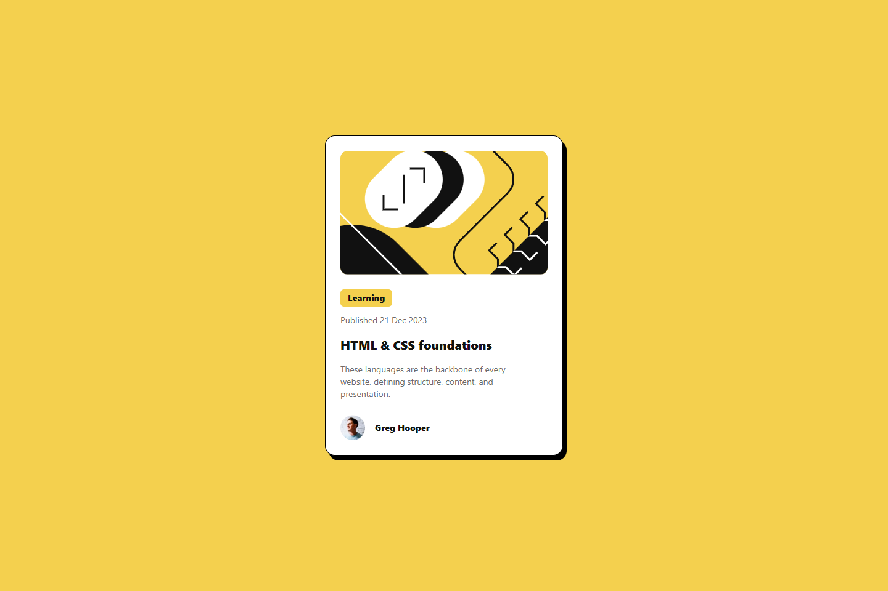

# Frontend Mentor - Blog preview card solution

This is a solution to the [Blog preview card challenge on Frontend Mentor](https://www.frontendmentor.io/challenges/blog-preview-card-ckPaj01IcS). Frontend Mentor challenges help you improve your coding skills by building realistic projects.

## Table of contents

- [Overview](#overview)
  - [The challenge](#the-challenge)
  - [Screenshot](#screenshot)
  - [Links](#links)
- [My process](#my-process)
  - [Development Process](#development-steps)
  - [Built with](#built-with)
  - [What I learned](#what-i-learned)
- [Author](#author)
- [Acknowledgments](#acknowledgments)

## Overview

### The challenge

Users should be able to:

- See hover and focus states for all interactive elements on the page

### Screenshot



### Links

- Solution URL: [Github Repository](https://github.com/DavidFayemi/Blog-preview-card)
- Live Site URL: [Github Pages](https://your-live-site-url.com)

## My process

### Development Steps

1. Arranged Folder Structure
2. Installed TailwindCSS
3. Updated .gitignore to ignore node modules and design folder
4. Configured [tailwind.config.js](./tailwind.config.js) to add the custom colors and fonts and the custom box shadow
5. Styled the Page with tailwindCSS utility classes
6. Added hover effects
7.

### Built with

- Semantic HTML5 markup
- CSS custom properties
- TailwindCSS
- Mobile-first Design

### What I learned

- Adding Custom Font-Families to Tailwind
- Adding custom colors to Tailwind
- basic confuguring of [tailwind.config.js](./tailwind.config.js)

```html
<h1
  class="font-extrabold my-4 text-xl transition-colors hover:text-primary cursor-pointer"
>
  HTML & CSS foundations
</h1>
```

## Author - Frontend Mentor -

[@DavidFayemi](https://www.frontendmentor.io/profile/DavidFayemi)

## Acknowledgments

> All Glory to God
